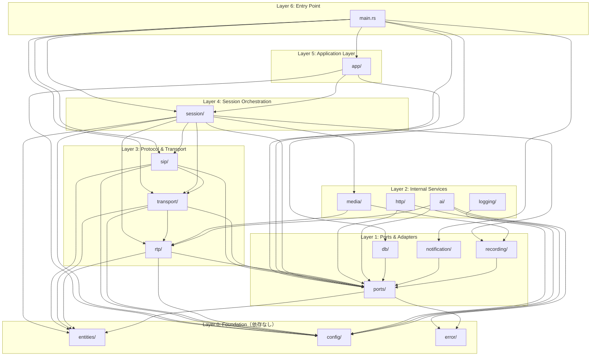
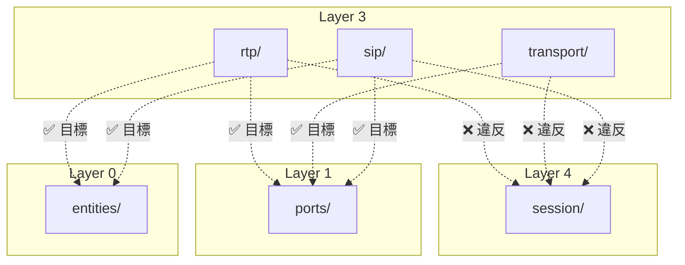
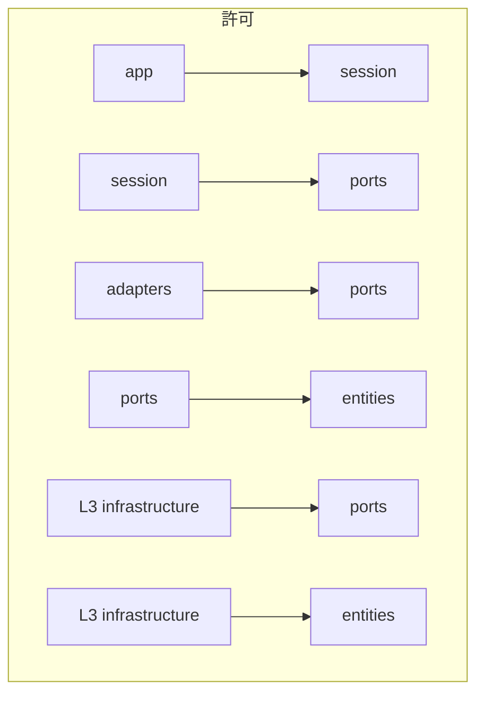
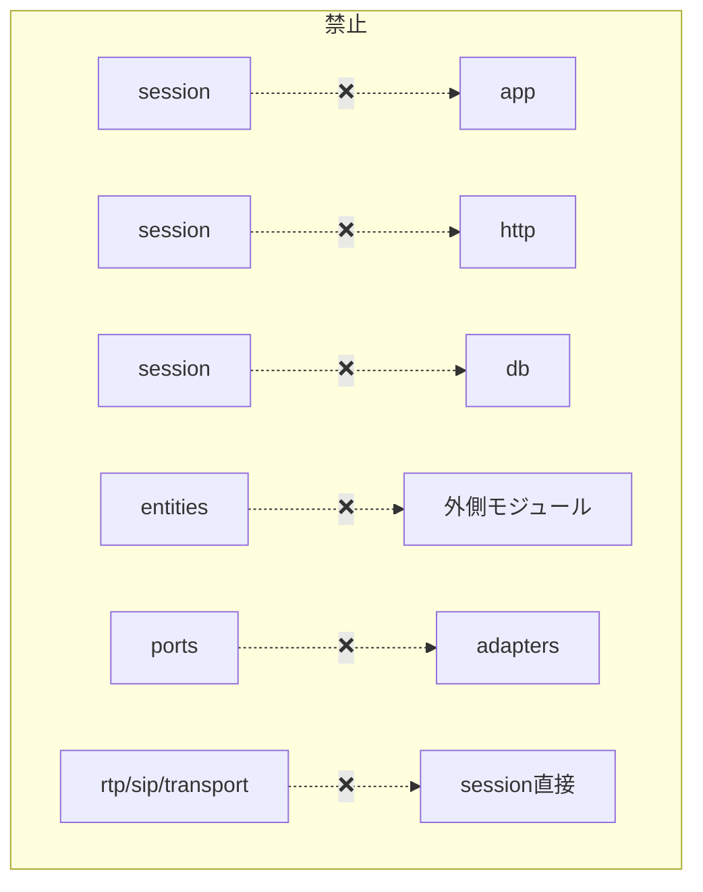
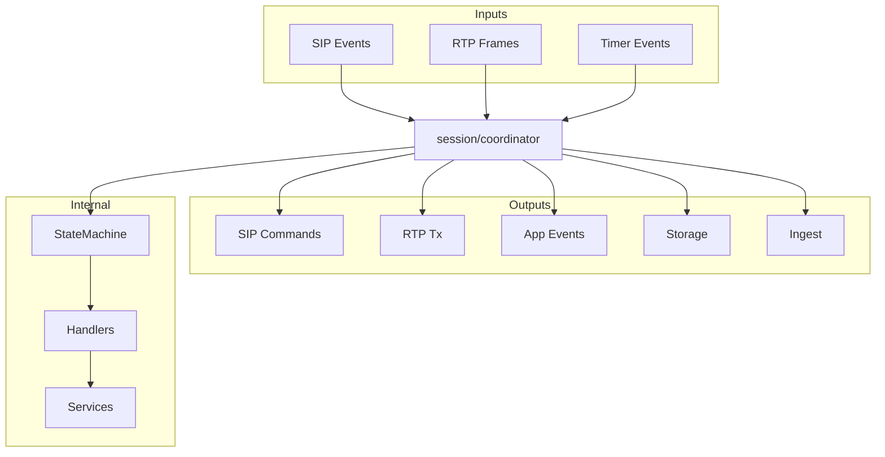

# BD-003 付録：依存関係図

> モジュール依存を可視化（2026-02-05 時点・BD-003 v2.1 対応）

## 1. 全体依存関係図（目標状態）

> Phase 5 完了後のターゲット。L3→session 直接依存を撤廃し、L3→ports 経由に統一。

## 2. 現状の依存関係図（Phase 5 未対応）

> 現行コードで残存する L3→session 直接依存を破線で表示。

## 3. 許可される依存方向

## 4. 禁止される依存方向

## 5. 現状の検証結果（2026-02-05）

| 禁止依存 | 状態 | 備考 |
|----------|------|------|
| session → app | ✅ なし | Phase 1.5 で解消 |
| session → http | ✅ なし | Phase 1.5 で解消 |
| session → db | ✅ なし | Phase 2.5 で解消 |
| session → recording（直接） | ✅ なし | Phase 2.5 で ports 経由に移行 |
| app → db（直接） | ✅ なし | ports 経由 |
| entities → 外側 | ✅ なし | |
| **rtp → session（直接）** | ❌ **違反あり** | rx.rs:19-20（Phase 5 で解消予定） |
| **sip → session（直接）** | ❌ **違反あり** | core.rs:2, builder.rs:4, types.rs:1（Phase 5 で解消予定） |
| **transport → session（直接）** | ❌ **違反あり** | packet.rs:15-16（Phase 5 で解消予定） |

## 6. モジュール層対応表

| モジュール | BD-003 レイヤー | 許可される依存先 |
|------------|----------------|-----------------|
| `entities/` | Enterprise Business Rules | なし（最内側） |
| `ports/` | Port定義 | entities, error |
| `app/` | Application Business Rules | ports, session, config |
| `session/` | Application Business Rules | ports, entities, config, protocol層 |
| `ai/`, `db/`, `http/`, `notification/` | Interface Adapters | ports, config, error |
| `sip/`, `rtp/`, `transport/` | Frameworks & Drivers | config, ports, entities |
| `recording/`, `media/` | Interface Adapters | ports |
| `config/`, `error/`, `logging/` | Infrastructure | なし（横断的関心事） |

## 7. session モジュールの責務

session は **オーケストレーションハブ** として以下を統合：

---

## 変更履歴

| 日付 | バージョン | 変更内容 | 作成者 |
|------|-----------|---------|--------|
| 2026-02-03 | 1.0 | 初版作成（#95 依存関係分析より） | Claude Code |
| 2026-02-05 | 2.0 | BD-003 v2.1 対応: L3→session 撤廃を反映、目標/現状の2図構成に変更、禁止依存にL3→session追加、検証結果に違反3件追記 | Claude Code |
