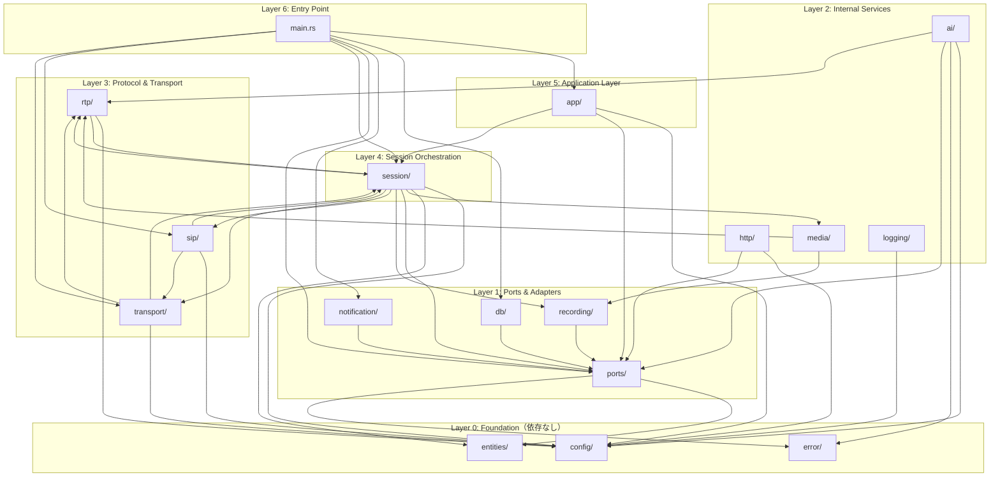
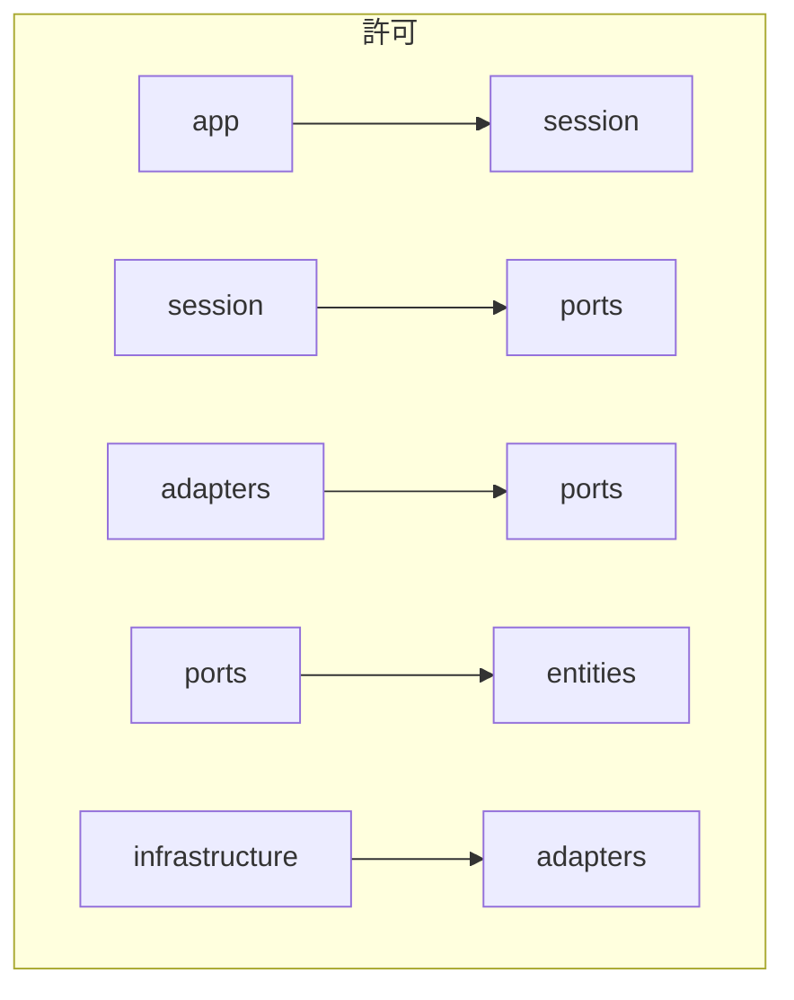
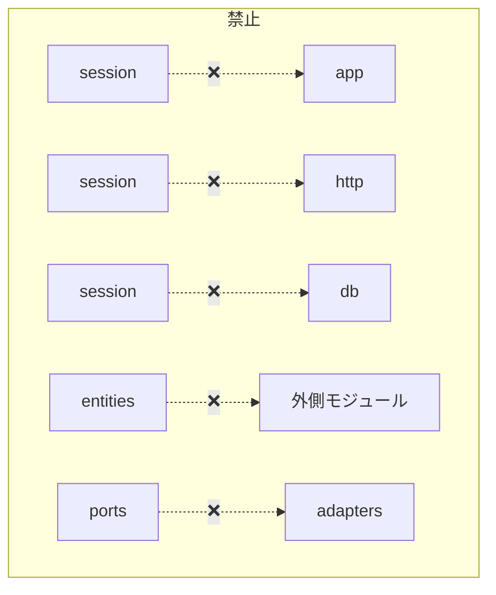

# BD-003 付録：依存関係図

> 現状のモジュール依存を可視化（2026-02-03 時点）

## 1. 全体依存関係図

## 2. 許可される依存方向

## 3. 禁止される依存方向

## 4. 現状の検証結果（2026-02-03）

| 禁止依存 | 状態 |
|----------|------|
| session → app | ✅ なし |
| session → http | ✅ なし |
| session → db | ✅ なし |
| session → recording（直接） | ✅ ports経由に移行済み |
| app → db（直接） | ✅ ports経由 |
| entities → 外側 | ✅ なし |

## 5. モジュール層対応表

| モジュール | BD-003 レイヤー | 許可される依存先 |
|------------|----------------|-----------------|
| `entities/` | Enterprise Business Rules | なし（最内側） |
| `ports/` | Port定義 | entities, error |
| `app/` | Application Business Rules | ports, session, config |
| `session/` | Application Business Rules | ports, entities, config, protocol層 |
| `ai/`, `db/`, `http/`, `notification/` | Interface Adapters | ports, config, error |
| `sip/`, `rtp/`, `transport/` | Frameworks & Drivers | config, session（コールバック用） |
| `recording/`, `media/` | Interface Adapters | ports |
| `config/`, `error/`, `logging/` | Infrastructure | なし（横断的関心事） |

## 6. session モジュールの責務

session は **オーケストレーションハブ** として以下を統合：

---

## 変更履歴

| 日付 | バージョン | 変更内容 | 作成者 |
|------|-----------|---------|--------|
| 2026-02-03 | 1.0 | 初版作成（#95 依存関係分析より） | Claude Code |
